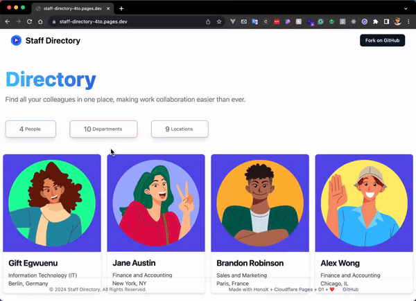

# Staff Directory - Built with HonoX, Cloudflare Pages and D1

Staff Directory is an intuitive Employee Resource Hub designed to simplify the way teams interact and collaborate. Built using the powerful combination of HonoX for backend logic, Cloudflare Pages for fast and secure hosting, and Cloudflare D1 for seamless database management.

## Features

- **Employee Listings**: Access a comprehensive list of employees to easily find and learn about colleagues.
- **Dark Theme Mode**: Enhance your viewing experience with a built-in dark theme mode.
- **Employee Count**: View the total number of employees at a glance.
- **Simple Authentication**: Secure your data with basic authentication provided by Hono/Basic Auth.

## Demo



## Getting Started

To get a local copy up and running, follow these simple steps.

### Prerequisites

- Node.js
- npm

### Installation

1. Clone the repository:
   ```sh
   git clone https://github.com/lauragift21/staff-directory.git
   ```
2. Install NPM packages:
   ```sh
   npm install
   ```
3. Start the development server:
   ```sh
   npm run dev
   ```
4. Copy the wrangler config file
   ```sh
   cp wrangler.example.toml wrangler.toml
   ```
5. Create a DB with Wrangler and copy config to wrangler.toml
   ```
   npx wrangler d1 create <DATABASE_NAME>
   ``` 
6. Seed local DB with data
   ```sh
   npx wrangler d1 execute <DATABASE_NAME> --local --file=./schema.sql   
   ```
7. Create a bucket with Wrangler and copy config to wrangler.toml
   ```
   npx wrangler r2 bucket create <NAME>
   ```

### Deployment

To deploy this project on Cloudflare Pages, follow these steps after setting up your Cloudflare Pages account:

1. Push your code to a GitHub repository.
2. Connect your GitHub repository to Cloudflare Pages.
3. Set the build command:
   
   ```sh
   npm run build
   ```
4. Deploy your site.

## Contributing

We welcome contributions. Any contributions you make are **greatly appreciated**.

1. Fork the Project
2. Create your Feature Branch (`git checkout -b feature/AmazingFeature`)
3. Commit your Changes (`git commit -m 'Add some AmazingFeature'`)
4. Push to the Branch (`git push origin feature/AmazingFeature`)
5. Open a Pull Request

## License

Distributed under the MIT License. See `LICENSE` for more information.

## Resources

- [Hono](https://honojs.dev/)
- [Cloudflare Pages](https://pages.cloudflare.com/)
- [Cloudflare D1](https://www.cloudflare.com/products/d1/)
